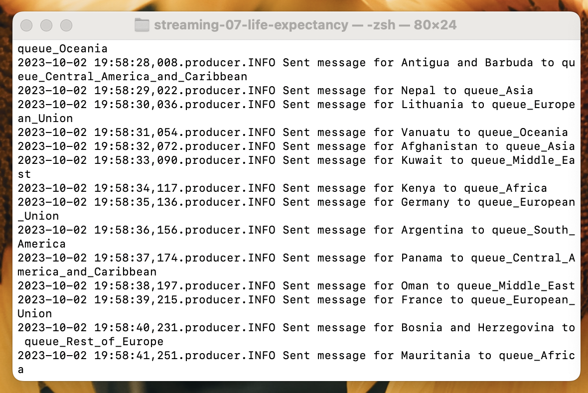

# Project Overview
The objective of this project was to leverage the Life Expectacy Data set provided by Kaggle. This dataset contains the life expectancy collected by the World Health Organization. It outlines multiple data points, but my primary focus was on the **life expectancy and GDP per capita.**

From the data points provided by the CSV file; I gathered the criteria on the average life expectancy and GDP per capita in 2020. 
- **2020 Data:**
    - **Life Expectancy:** 72.72
    - **GDP per Capita:** 10,881

The goal is that my producer/consumer programs read the CSV file, and create an output directory that contains the countries by region that exceed the average. The program will then send me an email with each region's CSV file to an email for review. 

## Project Prerequisties
1. Git
1. Python 3.7+ (3.11+ Preferred)
1. VS Code Editor
1. VS Code Extension: Python (by Microsoft)
1. RabbitMQ
1. dotenv
    - Install **dotenv** by `pip install python-dotenv`

## Getting Started
1. Fork this starter repo into your GitHub.
1. Clone your repo down to your machine.
1. View / Command Palette - then Python: Select Interpreter
1. Select your conda environment. 

## Project Libraries

### Producer Libraries
- pika
    - Enables communication with RabbitMQ's message broker, allowing the publishing and consumption using the AMQP protocol.
- sys
    - offers access to Python interpreter variables and functions, allowing manipulation of the Python runtime environment, including exiting the program and handling paths.
- webbrowser
    - webbrowser is a convenient module for launching and managing web browsers, enabling Python scripts to open web pages or HTML files in a browser window, aiding in automated web interactions and testing.
- CSV
    - Facilitates the reading and writing of the data between Python programs and CSV files.
- os
    - The os module provides a portable way of using operating system-dependent functionality, such as reading/writing files, launching and killing processes, and managing directories.
- time
    - The time module provides various time-related functions, including retrieving the current time, delaying program execution, and formatting time, essential for handling durations and timestamps.
### Consumer Libraries
- CSV
- pika
- os
- sys
- threading
    - The threading module allows the creation, synchronization, and management of multiple threads in a Python program, enabling concurrent execution for improved efficiency.
    - Used to allow the consumer to dynamically manage multiple queues
- smtplib
    - is used for sending emails using the Simple Mail Transfer Protocol (SMTP), supporting server authentication and secure connections.
        - MIMEMultipart
        - MIMEText
        - MiMEBase
        - encoders
- glob
    - The glob module is used to retrieve files/pathnames matching a specified pattern, simplifying file handling and manipulation.
- signal
    - signal provides mechanisms to handle signals and timers, allowing Python programs to have more control over interactions with the operating system.
- dotenv
    - The dotenv module enables loading environment variables from a .env file into the environment, securing sensitive information.
        - load_dotenv
            - load_dotenv is a function within the dotenv module that loads environment variables from a .env file into the environment for access and management within the application.

# Producer

## Producer Overview
The producer is responsible for sending messages to the appropriate queue based on the Region name for the country it will evaluate. This program leverages an intermediate_file_name to store the processed messages from the original CSV file. Additionally, users have the option to monitor the queue via a prompt to open the RabbitMQ Admin web page. 

### Program Functions
1. offer_rabbitmq_admin_site()
    -  offers the user to open the RabbitMQ admin page
1. send_to_queue()
    - establishes a connection
    - messages are delivered persistently to ensure that if RabbitMQ fails or restarts it will not be lost.
1. stream_csv_messages()
    - **Parameters:**
        - input_file_name (str): original CSV file
        - intermediate_file_name (str): intermediate CSV file that stores all sent messages
        - host (str): host name or IP address of the RabbitMQ server
    - This will write a row with the headers of Country, Region, Year, Life Expectancy, and GDP per Capita. The program will also let the user know that the message was sent for the country to the specific queue name, and that the data was written to an intermediate file. 

#### Screenshots

**Producer Terminal**

# Consumer

## Consumer Overview
The consumer program is responsible for consuming the messages sent via dynamic queues based off a countries region. This is leveraging multi-threading. The program will then output the message into a output csv file if it meets the criteria (*Life expectancy & GDP per captia greater than the average*). After the program is interrupted by the user the program will send an email to to the specified to email with the CSV files as an attachment. 
### Program Functions
1. signal_handler()
    - Used to gracefully handle the CTRL+C command from the keyboard.
    - In this program it is used for catching the interruption signal and setting the shutdown_flag to True. When the user presses CTRL+C, the signal_handler function is invoked, and it updates the shutdown_flag variable. 
1. send_email
    - Used to send an email to the TO_EMAIL defined in the .env file for protection for this project. This could be subsituted for your own value. It will create a dynamic subject line with the dynamic_queue names from the regions with output CSV files. 
    - .env file was used for security purposes to not disclose credentials for emails
    - **Parameters:**
        - subject
        - body
        - attachment_path
            - attachment will be the Output CSV files for the appropriate regions
        - to_email
            - stored within a .env file but could be passed in normally to change the to_email
        - from_email
            - stored within a .env file
        - stmp_server
            - utilized Gmail server for this process
        - port
        - login
            - stored within a .env file
        - password
            - stored within a .env file
        - queue_name
            - passed to this function to create a dynamic email with the queue name which is the region. This will be part of the subject so the user knows which data set is which that is emailed. 
1. callback
    - the call back function is responsible for the following:
        1. Strip the incoming message of blank spaces and map to the appropriate row for the output
        1. Evaluate the incoming message's data if the country's life expectancy and GDP per capita is greater than the average of the 2020 data. 
        1. If the country is above the average it will write to the appropriate output csv file for the region with the data of country, row, year, life_expectancy, and gdp_per_capita.
1. worker
    - In the past we've called this the main function, but because I explored multi-threading in this final project. 
    - Declares queues as durable and takes in the dynamic queue_name which will be the region. 
    - Introduces the shutdown_flag to gracefully handle the user interrupting the consumer with CTRL + C. 

### __main__ Information
The main function handles a lot of logic for this project. It is dynamically setting the queue through a multi-threading process. The intermediate file will be opened and the appropriate worker for the queue will handle the evaluation. After the program is interrupted the shutdown_flag gracefully handles the interruption and calls the send_email function to send a summary of each region as a stand-alone email to the defined to_email. 

### Multi-Threading      
In this program, multi-threading is employed to enable the concurrent processing of messages from multiple RabbitMQ queues. Each region's data is streamed into a distinct queue, and to efficiently process these data streams in parallel, a separate thread is allocated to each queue. This multi-threading approach ensures that the program can scale effectively, handling multiple queues without any one queue blocking the processing of another. It aids in maximizing the throughput and responsiveness of the consumer application, ensuring that data from all regions is processed in a timely manner, even as the volume of incoming data increases. By distributing the processing workload across multiple threads, the program can utilize the available CPU resources more effectively, leading to enhanced performance and the ability to handle larger volumes of streaming data seamlessly. 

### Email Functionality
The email functionality integrated into these programs provides a systematic and automated means of communicating important notifications and data files directly to users. When the consumer program is interrupted (for instance, via a CTRL+C command), it triggers an automatic email sending mechanism that dispatches emails containing the gathered data as attached CSV files. Utilizing the smtplib library, the program establishes a secure connection to an SMTP server, authenticates using the provided credentials, and dispatches emails with informative subjects and bodies, ensuring users are promptly notified and receive the relevant data files. 
#### .env Design
As called out above, I used a .env file for security purposes. The .gitignore file ignores .env file and I was able to store my credentials within the file. 
1. Reading from .env files
- I used the dotenv and load_dotenv to load the .env file into my program. 
    - `from dotenv import load_dotenv`
- The .env file stored my credentials so I specifically called the environment variables in this code block: 
    - `FROM_EMAIL = os.getenv('EMAIL')`

#### Troubleshooting for Email
During this program's creation I ran into the issue where Gmail no longer offers the option to allow access to less secure applications (post 2022). 

- Below are the steps I followed to authorize access to my email:  

    - Go to My Account in Gmail and click on Security. 
    - After that, scroll down to choose the Signing into Google option.
    - Now, click on App Password. (Note: You can see this option when two-step authentication is enabled). To enable two-step authentication:
        1. From the Signing into Google, click on the Two-step Verification option and then enter the password.
        1. Then Turn ON the two-step verification by entering the OTP code received on the mobile.
    - (Here's a quick link to the same page: https://myaccount.google.com/apppasswordsLinks to an external site.)

    - Here, you can see a list of applications, choose the required one.
    - Next, pick the Select Device option and click on the device which is being used to operate Gmail.
    - Now, click on Generate.
    - After that, enter the Password shown in the Yellow bar.
    - Lastly, click on Done.

#### Screenshots
1. Produer/Consumer Terminal

1. Consumer Queue

1. Closing Connections

1. Consumer Email Output

1. CSV Files in Email
